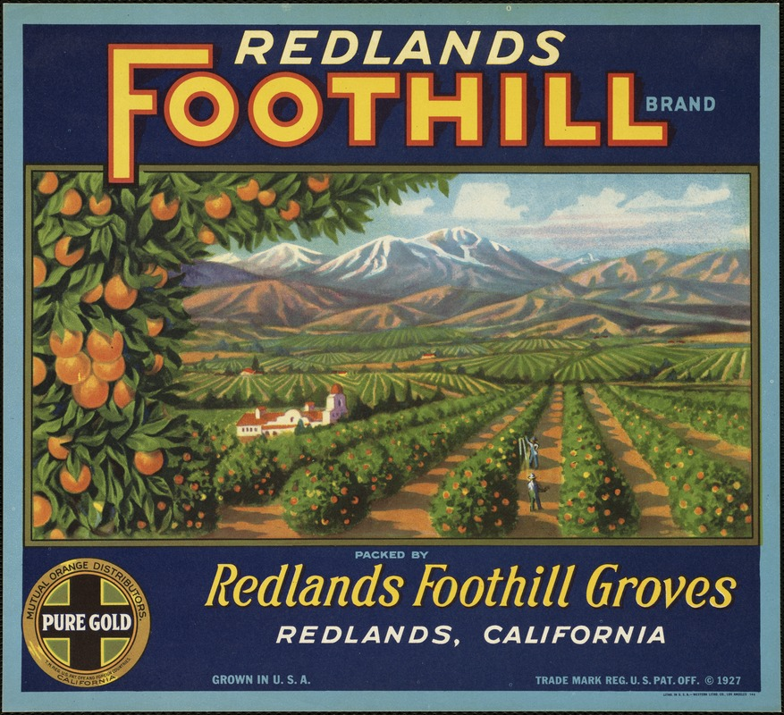

# Scraping [Fruit Crate Labels](https://www.digitalcommonwealth.org/search?f%5Bgenre_specific_ssim%5D%5B%5D=Fruit+Crate+Labels) from the Digital Commonwealth: Massachusetts Collection Online

### About

These python scripts were written as part of a digital humanities course taken at Pratt Institute. They were designed to help a fellow student with her project centered on image analysis. Check out that project [here](http://studentwork.prattsi.org/dh/analyzing-produce-crate-label-images-via-python-and-imagej)

### How to use this repository

There are two scripts in this repo: The first script, 1_Fruit_Crate_Labels_JSON.py, scrapes the URL for each digital item, the image caption, and the image URL. This information is written to JSON and that JSON is used by the second script, 2_Fruit_Crate_Labels_Image_Download.py, to download the images locally. Before running the second script, an empty folder titled "Images" need to be created in your directory; this is where the images will be downloaded to. The label titles are used as the file names for each image; however, a tool such as NameChanger (https://mrrsoftware.com/namechanger/) could be used to rename the image files as necessary.

Any questions can be directed to genevieve[dot]milliken[at]gmail[dot]com

